# Como instalar e configurar Linux em uma máquina virtual parte 1/3

Salve galera, tudo joia?

Hoje vou estar fazendo um Tutorial sobre como instalar e configurar algumas das distribuições Linux em um ambiente virtual. Estarei dividindo o artigo em três partes para que fique tudo organizado por tópicos:
* Parte 1: O que são máquinas virtuais e como instalar o VirtualBox em sua máquina;
* Parte 2: Como instalar o Ubuntu na máquina virtual;
* Parte 3: Como instalar o CentOS camada a camada na máquina virtual;

Portanto, esta parte do artigo se concentra em explicar sobre o que são máquinas virtuais, como instalar o VirtualBox e uma breve explicação sobre as funcionalidades do VirtualBox. 

### O que é uma máquina virtual?

A máquina virtual (VM) ou camada de virtualização, é um ambiente que simula um Sistema Operacional inteiro dentro de um único software. Isso é útil para que você possa testar recursos de um SO, instalar e configurar programas ou ainda criar ambientes virtuais para diferentes propósitos. É possível executar várias máquinas virtuais de uma só vez e usá-las em paralelo, a limitação se dá pelo seu hardware.

A virtualização é diferente de um emulador, pois na emulação de um programa a aplicação ou sistema emulado trabalha em conjunto com a seu SO principal. Já a máquina virtual opera de maneira completamente independente, com a possibilidade até de rodar SOs que normalmente não seriam compatíveis com a sua arquitetura.

### Qual a utilidade na prática de uma máquina virtual?
Em termos de usuário, uma VM é uma excelente forma de executar um sistema operacional novo antes de instalá-lo em definitivo em sua máquina, assim você pode testar recursos e antecipar possíveis erros e problemas. 

Para desenvolvedores, a vantagem de utilizar máquinas virtuais é a possibilidade de instalar diferentes versões de softwares para cada aplicação desenvolvida. Além da possibilidade de testar os projetos em diferentes sistemas.

Mas o melhor uso da virtualização, que é onde ela mostra todo seu potencial é no ambiente corporativo. Com a camada de virtualização é possível executar uma grande quantidade de máquinas virtuais, reduzindo o consumo de energia e a necessidade de manter um hardware físico.

### Limitações

Mas nem tudo são flores, dependendo do uso a máquina virtual ela pode apresentar limitações. 

A primeira delas diz respeito ao hardware onde a camada de virtualização será instalada. Embora a VM trabalhe de maneira independente do seu SO principal, ela ainda sim compartilha os recursos de hardware com a sua máquina física. Ou seja, para executar um SO na VM você na verdade estará executando dois SOs, o principal e o virtual.

Outra limitação é referente a custos. Enquanto rodar distribuições Linux livres para uso pessoal não requer maiores exigências do que baixar e instalar na VM. O mesmo não pode ser dito para Windows ou distros pagas, como é o caso do SUSE. Para usá-las de modo legal, é preciso adquirir a licença para cada máquina virtual.

Da mesma forma, a Apple não permite que o macOS seja rodada em nenhuma plataforma de virtualização (em teoria, nenhuma VM deveria oferecer suporte), porque o sistema operacional é dedicado exclusivamente para ser executado em computadores Macs.

### Vamos para a prática

O software que eu escolhi para realizar a virtualização foi o Oracle VirtualBox, pois ele é gratuito, de código aberto, compatível com Windows, MacOS e Linux, rápido e fácil de utilizar. Para baixar o virtualbox basta ir no site <a href="https://www.virtualbox.org/">virtualbox.org</a>, clicar na opção download e selecionar para qual SO você quer instalar.

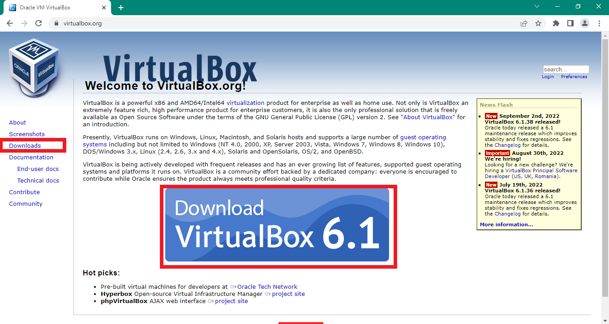

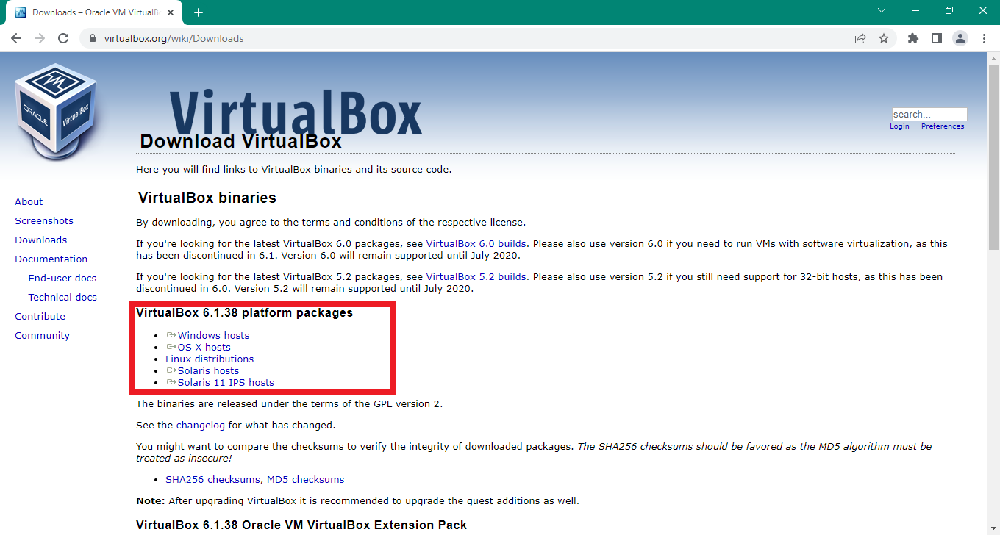

O processo de instalação é bastante simples, basta você clicar em próximo até concluir a instalação.

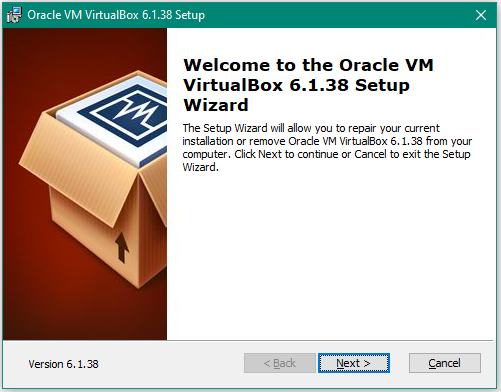 
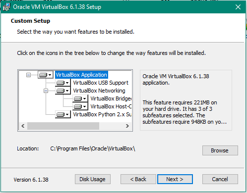 
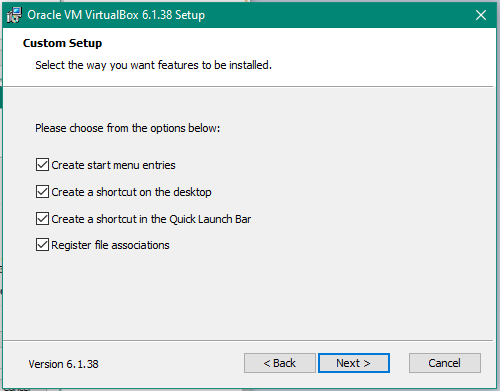 

Aqui o VirtualBox apresenta uma mensagem de Aviso, dizendo que vai desconectar a sua internet temporariamente durante a instalação, mas não se preocupe, serão poucos segundos, você nem irá perceber.

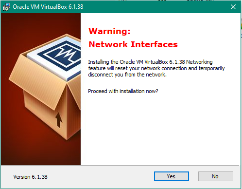 
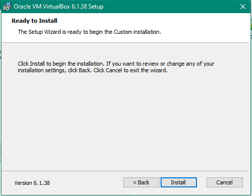 
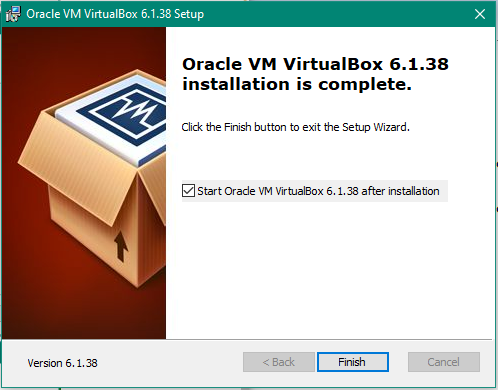 

Pronto, o VirtualBox já foi instalado. Agora vamos navegar um pouco pela interface antes de partirmos para a instalação dos SOs.

### Navegando pela Interface

Está é a tela inicial do VirtualBox. Veja que ela é bastante simples e bem intuitiva. Vamos explorar as opções.

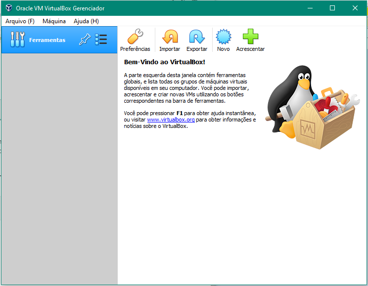

Começando pelas principais funcionalidades do VirtualBox:

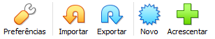

* **Preferências**: Aqui você pode fazer as configurações básicas do VirtualBox. Como: Diretório Padrão, configuração de atalhos, configurar atualização automática, idioma, configurações de rede e de proxy.
* **Importar**: Opção para que você possa importar uma Máquina Virtual já pronta.
* **Exportar**: Opção para que você possa exportar sua VM no estado atual, usaremos essa opção nos próximos tutoriais. 
* **Novo**: Opção para a criação de novas VMs. Nos próximos tutoriais eu irei explicar os detalhes desta opção.
* **Acrescentar**: Esta opção serve para caso você já tenha uma VM em sua máquina. Por exemplo: Imagina que você deletou o seu VirtualBox por algum motivo, manteve as VMs e depois decidiu instalá-lo novamente. Você pode simplesmente recuperar as suas VMs que já estavam instaladas e configuradas simplesmente clicando nesta opção.

No menu superior temos diversas outras possibilidades de opções. Irei detalhando pontualmente à medida que utilizarmos. Mas de cara você pode perceber que algumas opções são repetidas. Importar Appliance, Exportar Appliance, Novo e Acrescentar são as mesmas que eu expliquei anteriormente.

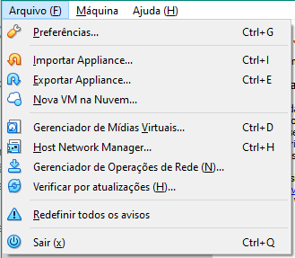 
 
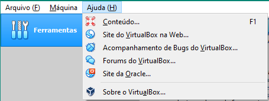 

Essa foi a primeira parte do tutorial. Nela expliquei sobre o conceito de máquinas virtuais e como instalar o VirtualBox. Na parte dois darei sequência explicando como instalar o sistema operacional Ubuntu e na terceira parte o CentOS.
