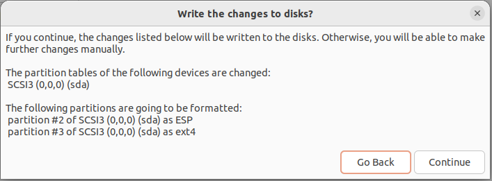
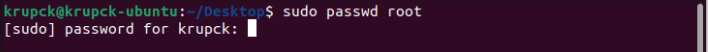

# Como instalar e configurar Linux em uma máquina virtual parte 2/3

Salve pessoal, tudo certo?

Agora darei sequência ao tutorial de como instalar e configurar o SO Linux em ambientes virtuais. Nesta parte trarei um passo a passo completo de como instalar a distribuição Linux mais famosa em termos de usuário, o Ubuntu.

Estamos na parte 2 do artigo, no último artigo eu trouxe uma visão geral sobre o que são máquinas virtuais e como instalar o VirtualBox em seu SO.
* <strike>Parte 1: O que são máquinas virtuais e como instalar o VirtualBox em sua máquina;</strike>
* Parte 2: Como instalar o Ubuntu na máquina virtual;
* Parte 3: Como instalar o CentOS camada a camada na máquina virtual;

Mas antes partir para a instalação, vamos entender um pouco mais sobre o que é o Ubuntu.

### O que é o Ubuntu?

O Linux Ubuntu é um SO que entrega uma interface intuitiva e amigável para o usuário final, além de proporcionar melhorias de segurança para os seus usuários. Na definição do próprio distribuidor, Ubuntu é um sistema operacional Linux completo, disponível gratuitamente com suporte da comunidade e profissional. A comunidade é construída sobre as idéias do Manifesto Ubuntu: 
* O software deve estar disponível gratuitamente; 
* As ferramentas de software devem ser utilizadas por pessoas em seu idioma local e apesar de quaisquer deficiências;
* Deve-se ter a liberdade de personalizar e alterar o software da maneira que acharem melhor. 

### Vatangens da distribuição do Ubuntu
A maior vantagem do Ubuntu sobre as outras distribuições, com certeza é a estabilidade de suporte. É distribuído em ciclos de lançamento estáveis e regulares, com um novo lançamento sendo enviado a cada seis meses. A cada dois anos, uma versão de suporte de longo prazo do Ubuntu (LTS) estará disponível, com assistência por 5 anos. As versões intermediárias do Ubuntu – conhecidas como versões de desenvolvimento ou não LTS – são suportadas por 9 meses cada uma.

Focando da praticidade do uso, a distribuição Ubuntu inclui muitas peças de software, começando com o kernel Linux versão 5.4, GNOME 3.28, e cobrindo todos os aplicativos de desktop padrão de processamento de texto, aplicativos de planilha, aplicativos de acesso à Internet, software de servidor web, software de e-mail, linguagens de programação e ferramentas e vários jogos.

1. **Parceria com a Canonical**: O Projeto Ubuntu é patrocinado por uma parceria com a Canonical Ltd. A Canonical não cobra taxas de licença da distribuição, nem agora ou no futuro. O modelo de negócios da Canonical é fornecer suporte técnico e serviços profissionais relacionados ao Ubuntu. 

2. **Uso Amigável**: Um dos grandes receis dos usuários é achar que o universo Linux é muito complexo ou difícil em comparação com outros SOs. O Ubuntu vem para combater um pouco esse paradigma oferecendo um SO baseado em Linux simples de ser instalado, fácil de usar e com uma interface bastante agradável.

3. **Bastante seguro**: Por se tratar de uma distribuição Linux, que é um SO baseado em camadas de privilégios, o Ubuntu se beneficia desta arquitetura e pode se dizer que o risco de um ataque de vírus é quase nulo. Tanto é que você não precisa sequer adquirir e instalar antivírus que o SO estará muito bem protegido de ataques. 

4. **Funciona em computadores simples**: Enquanto dois modelos específicos – Lubuntu e Xubuntu – são desenvolvidos para atender às necessidades de sistemas de baixo custo, o Ubuntu Unity padrão não precisa de requisitos de sistema de alto nível. Os requisitos de hardware recomendados são processador de 700 MHz, 512 MB de RAM e um disco rígido de 5 GB.

5. **Comunidade muito ativa**: Assim como outros projetos baseados em Linux e projetos Open-Source, o Ubuntu tem um forte suporte da comunidade e é uma das maiores vantagens em relação a outras distribuições. É simples ficar online, visitar fóruns do Linux e obter a resposta para todos os tipos de dúvidas sobre o sistema operacional.

6. **Alta customização**: Um dos pilares do manifesto Ubuntu, a possibilidade de personalizar o software da forma como você achar melhor. A liberdade de personalizar o sistema é uma das principais vantagens de um sistema operacional baseado em Linux. Se o usuário não gostar de nenhum ambiente de área de trabalho específico, poderá substituí-lo por um novo. 

### Desvantagens da distribuição do Ubuntu

Se o Ubuntu tivesse só vantagens como citado anteriormente, então para que existe outros SOs?

É claro que como tudo na vida, existem vantagens e desvantagens, e com o Ubuntu não poderia ser diferente, vou listar algumas desvantagens:
* **Aplicativos no Ubuntu**: Embora o Ubuntu cubra praticamente todos os tipos de softwares com versões alternativas e gratuitas em relação as grandes marcas do mercado, vale dizer que, em vários softwares, as versões gratuitas são bem limitadas em termos de funcionalidades se comparadas com as soluções proprietárias. Um exemplo clássico é o Adobe Photoshop, onde as soluções open-source não chegam nem perto do que oferece a Adobe.

* **Complexidade de adaptação**: Essa é uma dificuldade especialmente para quem sempre utilizou o Windows. Isso porque aprender sobre como funciona os SOs baseados em Linux demandam um pouco de esforço por parte dos usuários, principalmente a utilizar o terminal. Já que os usuários de Windows podem passar a vida toda sem sequer abrir o Prompt de Comando, enquanto que esta atividade é recorrente no dia-a-dia de quem utiliza Linux e MacOS.

* **Suporte a Drivers de Hardware**: A parcela de usuários finais (pessoas comuns que utilizam o SO no dia-a-dia) que utilizam Linux é baixíssima comparado com usuários de Windows e MacOS. Portanto as fabricantes de Hardware não têm a mesma preocupação em lançar e disponibilizar suas versões mais atuais de drivers na mesma medida que disponibilizam para Windows e MacOS.

* **Particularidade de versões**: É importante ter em mente que existem inúmeras versões do Linux e cada uma delas têm suas próprias particularidades. Essa falta de padronização torna um tanto mais complexa a procura pela que melhor pode suprir suas necessidades, mas, ao mesmo tempo, essa variedade e suas possibilidades tornam o fator da personalização ainda mais atraente.

Chega de Teoria, vamos para a prática. Primeiro você precisará fazer o download do Ubuntu. Basta ir na <a target="_blank" href="https://ubuntu.com/download/desktop">página oficial do Ubuntu</a> e selecionar a opção de Download. É bem intuitivo. Em seguida vai começar o download do arquivo no formato .iso. Esta é a imagem do Ubuntu.

Agora vamos para o VirtualBox, ao clicar em Novo, esta é tela que irá abrir para você:

* **Nome**: Onde você vai nomear o seu arquivo no VirtualBox. Pode ser qualquer nome.
* **Pasta da Máquina**: Neste local que o VirtualBox irá armazenar todos os arquivos gerados pela máquina virtual.
* **Tipo**: No tipo você escolhe qual é o Sistema Operacional, no nosso caso é o Linux.
* **Versão**: Selecione a versão do Ubuntu, se você baixou no link principal, então o padrão é 64-bit.

Após isso, clique em Próximo.

Agora aparece a opção para você selecionar a quantidade de memória RAM que você quer alocar para a máquina virtual. Veja que o VirtualBox sugere que você não ultrapasse uma certa quantidade, isto é porque você precisa deixar um pouco de RAM para seu SO principal. No meu caso irei utilizar 4GB de RAM.

Agora você tem algumas opções:
* Não criar um HD virtual;
* Criar um HD virtual;
* Utilizar um HD virtual existente;

A opção mais simples é criar um novo HD virtual. Desta forma você seleciona um espaço do seu HD físico para servir como HD virtual para o nosso sistema virtual. 

Você pode não acrescentar um HD virtual. Nesse caso os arquivos do SO serão instalados no próprio HD físico. Isso pode ser um problema, até porque você quer virtualizar as coisas e não estabelecar qualquer relação entre o SO virtual e o "mundo exterior".

Você pode criar um HD virtual separadamente e simplesmente adicioná-lo aqui. Para o nosso propósito isto não é relevante.

Portanto, deixa a opção padrão: **Criar um novo disco rígido virtual agora**

Agora você pode escolher o formato do arquivo que será armazenado no seu HD físico. Deixe a opção padrão: **VDI (Virtual Disk Image)**

Agora uma opção importe, você pode reservar 100% do espaço que você vai alocar ou deixar o tamanho dinamicamente alocado, isto é, ele vai crescendo à medida que você for utilizando até o tamanho limite.

Vamos utilizar o padrão: **Dinamicamente alocado**

Por fim, defina a quantidade de espaço que você vai alocar para o seu HD virtual. Eu defini 20 GB, pois é um tamanho mais do que o suficiente para instalar o SO.

Pronto! Criamos um ambiente virtual. Nossa próxima etapa é instalar o Ubuntu na nossa máquina virtual. Para começar, clique em inicar:

Lembra da Iso que nós baixamos no site do Ubuntu? Então, para selecionar o arquivo siga o passo a passo:

---

  
  

---

Neste momento será iniciado a máquina virtual. É como se você estivesse ligando a máquina pela primeira vez com o CD de instalação. Pressione Enter em **Try or Install Ubuntu**

Selecione o Idioma que deseja instalar o Ubuntu e clique em Install

Selecione o idioma do teu teclado. No meu caso, o teclado possui teclas como 'ç' e '~'. Está no formato Português (Brasil).

Talvez você tenha problemas do tamanho do layout na tela. Nesse caso você pode clicar e arrastar para o lado na janela de instalação do Ubuntu.

Deixe selecionado a instalação normal e permita que o Ubuntu baixe atualizações enquanto ele é instalado.

A instalação mínima baixa somente o necessário para o funcionamento do Ubuntu, é mais avançado, é utilizado principalmente quando você quer economizar o máximo de recursos com softwares desnecessários. Na parte 3 iremos fazer uma instalação a partir da Minimal Installation no sistema operacional CentOS.

Deixe marcado a opção Erase Disk, afinal, nosso disco virtual está vazio, então não tem problemas. Clique em Install Now.

Aqui o instalado como serão alocados o espaço em disco bem como o Sistema Gerenciador de arquivos. Clique em **Continue**

Selecione a sua localização para a definição do fuso-horário.

Defina o seu nome, o nome que será atribuido para a sua máquina, o nome de usuário e a senha para acessar a máquina. Clique em **Continue**.

Após a instalação ser concluída, o Ubuntu vai pedir para que você Reinicie a máquina. Clique em **Restart Now**.

Pronto! Agora é só logar e aproveitar o seu Ubuntu!

Agora temos diversas outras coisas para fazer como: Instalar e Atualizar pacotes e programas, configurar o usuário root, etc.. Por ora temos o ubuntu instalado, mas veja que a resolução é baixa e se você clicar em maximizar o Ubuntu continua com a mesma resolução.

Para corrigir isso vá em **Settings** -> Navegar o menu lateral até em **Display** -> Clicar em resolução e selecionar uma resolução maior.

Agora você pode Maximizar a tela de acordo com a resolução selecionada.

Para exibir a tela em modo Full Screen, basta clicar CTRL+F e para voltar ao modo janela clique CTRL+C.
> Nota: Tem que ser o CTRL do lado direito do seu teclado. 

Se você perceber, agora quando você reajustar o tamanho da tela, o Ubuntu vai reajustando junto. Bugs do VirtualBox, vai entender!

### Configurando o usuário root

Acesse o terminal pelo menu ou selecionando o botão direito e clicando em **open in terminal**.

Estamos no terminal. Motivo de pânico para alguns e desespero para outros, pois agora como já diria o tio do pavê: "Só nos compiuter em". Para ativar o usuário root primeiro digite:
> $` sudo passwd root`

Digite a senha que você quer para o usuário o root.
> Nota: Quando você digitar a caixa de texto não irá inserir nenhum caracter mesmo, nem os famosos `*****`, é normal.

> Caso a sua senha seja menor do que oito (8) caracteres, o Ubuntu vai pedir para você digitar mais uma vez para confirmar.

Com o usuário root configurado, vamos acessá-lo. Para acessar o usuário root digite:
> $ `su root`

### Instalando o Guest Additions do Virtualbox

Quem virtualiza uma distribuição Linux usando o Virtualbox facilmente se apercebe que nem tudo funciona da melhor maneira. Ou é a gráfica que não foi detetada, ou a definição do monitor não é a melhor, há dificuldade em interagir entre o sistema nativo e no sistema virtualizado, etc.

Para resolver tais problemas podemos instalar o Guest Additions.

O Guest Additions é basicamente é um conjunto de drivers que permitem:

* Um melhor desempenho a nível da placa gráfica (uma vez que normalmente a placa gráfica instalada dentro da máquina corresponde a uma genérica);
* Possibilidade da alteração da definição do monitor;
* Facilidade no compartilhamento de arquivos entre a máquina virtual e a máquina nativa (Share Folders);
* O mouse passa a funcionar de forma transparente no sistema nativo e no sistema virtualizado, isto é, não é necessário o CTRL (direito) para "tirar" o mouse dentro do SO.

Para instalar o Guest Additions no Ubuntu primeiro digite:

> `sudo apt install linux-headers-$(uname -r) build-essential dkms`

Digite `y` e Enter para confirmar e inicizar a instalação.

> Nota: Sempre que você for instalar algo no Linux ele vai pedir a sua confirmação. Responda `y` para sim/yes ou `n` para não/no

Nestas opções vá em **Dipositivos** -> **Inserir imagem de CD dos Adicionais para o Convidado** e clique em OK.

Clique em RUN e o Ubuntu vai começar a instalar os adicionais. Ao finalizar desligue a máquina virtual e ligue novamente. Você vai perceber uma melhor na fluidez da integração entre o seu SO e o SO virtualizado.

---

Pronto, agora você tem o Ubuntu instalado na sua máquina virtual. Aqui fizemos uma instalação padrão já com vários aplicativos incluindo a camada gráfica. Na parte 3 irei detalhar como instalar o CentOS camada a camada, partindo da versão minimal do SO. Além disso, irei mostrar como importar e exportar a aplicação para que possamos fazer backups.
