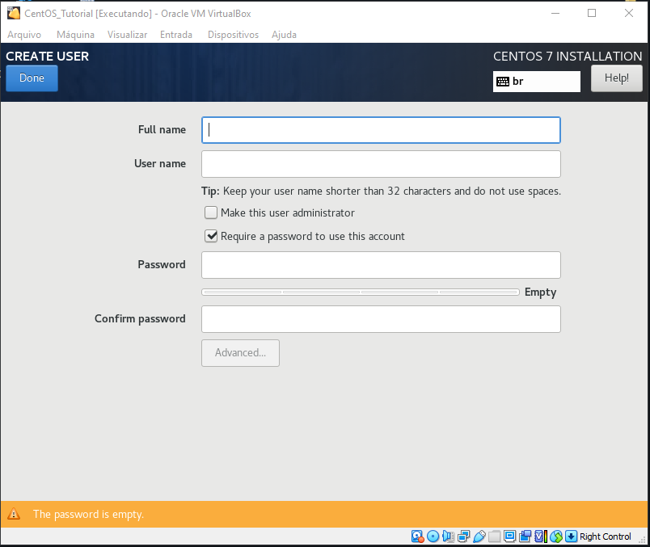
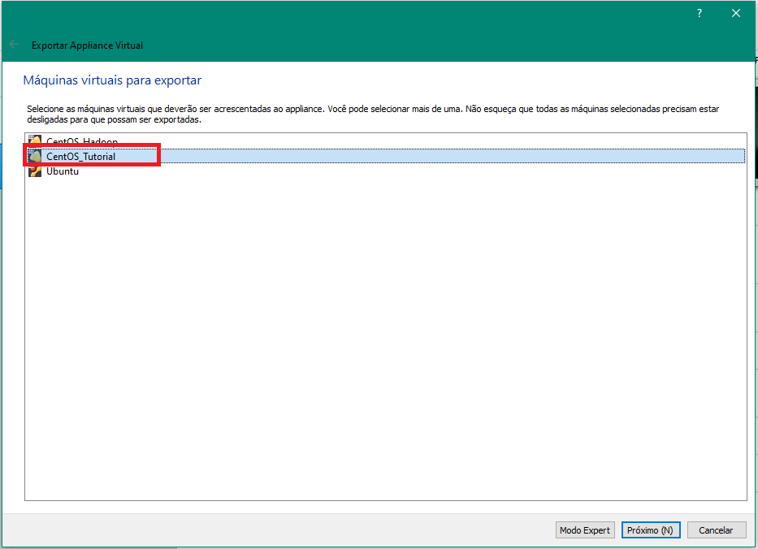

# Como instalar e configurar Linux em uma máquina virtual parte 3/3

Olá pessoal, tudo tranquilo?

Dando sequência, vamos para a parte 3 do tutorial. Agora irei mostrar como fazer a instalação e configuração do CentOS camada a camada em sua VM. Esta postagem traz conteúdos um pouco mais avançados que as duas primeiras. Portanto, recomendo fortemente a leitura das partes 1 e 2 antes de continuarmos.

* <strike>Parte 1: O que são máquinas virtuais e como instalar o VirtualBox em sua máquina;</strike>
* <strike>Parte 2: Como instalar o Ubuntu na máquina virtual;</strike>
* Parte 3: Como instalar o CentOS camada a camada na máquina virtual;

---

O CentOS é uma distribuição Linux derivada do Red Hat Enterprise Linux (RHEL) e é distribuída de maneira gratuita pela comunidade. Este sistema é amplamente utilizado pelo mercado. A Red Hat conta com uma família de distribuições:
* CentOS: Distribuição gratuita para servidores;
* RHEL: Distribuição paga e com suporte direto da empresa;
* Fedora: Distribuição voltada para máquinas de trabalho e com pacotes mais recentes.

O CentOS é uma distribuição Linux conhecida pelo seu alto nível de estabilidade, previsibilidade e pela possibilidade de ser configurada de múltiplas maneiras. Feita a partir do Red Hat Enterprise Linux (RHEL), ela é mantida em um modelo simples, com alto nível de transparência e abertura.

### Quais são as principais as vantagens do CentOS?

* **É gratuito**: Apesar de não ter suporte personalizado, como o Red Hat, por exemplo, o CentOS conta com uma comunidade ativa, pronta para solucionar problemas. Além disso, graças aos fóruns e à documentação oficial, as chances de uma falha não ter solução disponível é muito baixa.

* **Compatibilidade com o Red Hat**: Como os códigos-fonte do CentOS e do Red Hat Enterprise Linux são semelhantes, a compatibilidade entre os dois sistemas é elevada. Em outras palavras, é possível adotar extensões e aplicações semelhantes em ambos os ambientes, tornando a migração entre os sistemas ágil e segura.

* **Estabilidade de versões**: Outro ponto a se destacar é a facilidade para ser implementado. O CentOS não exige atualizações constantes e o suporte ao software é feito com uma visão de longo prazo. Dessa forma, a equipe de TI pode utilizar esse sistema mesmo em ambientes críticos, nos quais o número de interrupções aceitas para grandes updates é baixo. Além disso, a simplificação das rotinas de gestão de TI proporcionada por esse fator reduz os custos operacionais de médio e longo prazo.

* **Amigável com o usuário final**: Por ser um sistema operacional sólido e com uma boa interface gráfica, o CentOS também pode ser utilizado nas máquinas do usuário final. Isso dá liberdade para gestores de TI, que podem criar uma infraestrutura corporativa integrada e eficaz.

* **Leve e com ótima perfomance**: Vale destacar, também, que o baixo consumo de recursos torna o CentOS uma opção atrativa especialmente em companhias cujos dispositivos têm uma baixa capacidade de processamento.

**Referências:**
* [1] CentOS: Tudo O Que Você Precisa Saber Sobre Esta Distribuição Linux. Disponível em: <[e-tinet.com](https://e-tinet.com/linux/centos-distribuicao-linux/)>
* [2] SIMIONI, Dionatan. O que é CentOS e como usá-lo. Disponível em: <[hostgator.com](https://www.hostgator.com.br/blog/o-que-e-centos/)>

Sem mais delongas, vamos para a instalação. Neste tutorial estou assumindo que você já sabe como configurar, instalar e carregar uma iso no VirtualBox, pois irei começar direto com a instalação do CentOS. Caso não saiba, leia as partes 1 e 2 do tutorial.

### Download do CentOS Minimal

No site do CentOS é possível encontrar o arquivo de download facilmente. A arquitetura que iremos baixar será a `x86_64`. Basta clicar e você será redirecionado para a parte dos downloads, onde você vai selecionar de qual repositório você deseja baixar.

Link para download direto: [CentOS 7.9](http://mirror.ufscar.br/centos/7.9.2009/isos/x86_64/CentOS-7-x86_64-Minimal-2009.iso)

Selecione a versão **CentOS-7-x86_64-Minimal-2009.iso** e nesse momento o download será iniciado.

Após finalizar o download, inicie o VirtualBox, clique em Novo e crie uma nova Máquina Virtual.

> Nota: O VirtualBox não possui a opção CentOS na versão. Então selecione **Other Linux (64-bit)** e continue a criação da VM.

### No CentOS

Após iniciar o CentOS você se depara com a tela de instalação. Clique em **Install CentOS 7**

Se você leu a parte 2 do tutorial já percebeu uma semelhança na instalação do CentOs com a do Ubuntu. A primeira coisa a ser feita é a escolha do idioma principal do SO. Selecione o idioma desejado e clique em **Continue**.

Agora temos uma série de configurações para serem feitas, divididas em três abas:
* Localização;
* Software;
* System;

**Localização** 

Começando pela localização. Selecione a opção **DATE & TIME**.

Escolha o seu fuso-horário clicando em algum país. Clique em **Done** para confirmar.

**KEYBOARD**

Idioma do teclado. Caso o seu teclado seja o padrão Brasileiro, siga o passo a passo:

**Language Support**

Caso você queira instalar mais um idioma no seu SO. Não é necessário mexer nesse aqui.

**INSTALLATION SOURCE**

Está opção é para caso você queira adicionar repositórios adicionais, pode deixar do jeito que está por padrão.

**SOFTWARE SELECTION**

Está opção é para caso você queira adicionar softwares adicionais, pode deixar do jeito que está por padrão.

Vamos par a parte de SYSTEM

**INSTALLATION DESTINATION**

Aqui é para selecionar o disco no qual o SO será instalado, bem como configurações de partição. Pode deixar o padrão, pois o disco de instalação é o disco virtual que foi definido nas configurações da VM.

**NETWORK & HOSTNAME**

Por padrão, o CentOS deixa desligado a conexão com a internet. Devemos ativá-la.

 

**SECURITY POLICY**

Esta opção se refere as políticas de segurança. Vamos deixar o padrão.

---

Ufa, depois de todas essas configurações é hora de iniciar a instalação. Clique em **Begin Installation**.

Enquanto o CentOS é instalado vamos configurar o usuário padrão e o usuário root.

Começando pelo **ROOT PASSWORD**.

> Nota: Caso a senha seja considerada muito simples você terá que clicar em **Done** duas vezes.

**USER CREATION**

Passo bem semelhante ao que fizemos na instalação do Ubuntu. Defina o seu **Nome Completo**, **Nome de Usuário**, **Senha** e a **Confirmação de Senha**.

> Nota: Caso a senha seja considerada muito simples você terá que clicar em **Done** duas vezes novamente.

---

Com a instalação concluída clique em **Finish Configuration**. Nesse momento o SO vai configurar alguns arquivos de configuração e ao terminar clique na opção **Reboot**.

Pronto! Agora temos o nosso CentOS instalado. É só partir para a diversão kkkkk.

Calma, um SO cru desse jeito não tem muito serventia para nós. Vamos instalar camada a camada para adicionar mais recursos ao nosso SO.

A primeira etapa é logar no sistema. Óbvio que você lembra o seu username e senha né. Não é o root, e sim o usuário padrão.

Podemos mexer normalmente no nosso SO. Para quem não é habituado com Linux o comando `ls -la` exibe os diretórios e arquivos detalhados, vejamos:

Veja que só temos alguns arquivos de configuração no nosso SO. Vamos continuar a instalação.

### Instalação da Interface Gráfica, Componentes e outros Utilitários

Vamos começar verificando todos os grupos de pacotes disponíveis usando o comando `yum grouplist`. Como você pode ver na saída abaixo, precisamos basicamente instalar os grupos de pacotes **GNOME Desktop** e **Graphical Administration Tools**.

Antes de instalar um novo pacote, é sempre uma boa ideia atualizar o Sistema com as últimas versões disponíveis usando o comando yum update conforme mostrado abaixo.

> `sudo yum update`

Neste momento será solicitado a confirmação. Digite `y`.

Para instalar os grupos de pacotes GNOME Desktop e Graphical Administration Tools, você precisa usar:
> `sudo yum groupinstall "GNOME Desktop" "Graphical Administration Tools"`

Após a instalação bem-sucedida do ambiente GNOME Desktop, você precisa habilitar e tornar o modo gráfico como padrão. Isso pode ser feito usando o comando gráfico:

> `sudo systemctl set-default graphical`

Caso você não queira ficar digitando sudo e a senha toda vez, logue como usuário root:

> `su root`  
> Password: Digite sua senha de usuário root

Agora o comando pode ser simplesmente assim:

> `systemctl set-default graphical`

Pronto! Agora é só reinciar que na próxima inicialização o sistema já terá a interface gráfica.

> `reboot`

### Importando e Exportando Versão

Podemos desligar a VM por enquanto. 

No seu VirtualBox vá em Arquivo (F) e selecione a opção Exportar Appliance.

Escolha o CentOS que você acabou de instalar e clique em próximo

Deixa o Formato de Virtualização padrão Aberta 1.0.

Na opção Arquivo (F) Navegue até o diretório que você deseja guardar o arquivo. É interessante criar um diretório chamado backup para que você consiga controlar as versões de backups das suas VMs.

As outras opções você pode deixar como estão por padrão. Clique em próximo.

É recomendado você detalhar na descrição sobre do que se trata essa versão do backup. Segue a imagem:

Para finalizar clique em **Exportar**. Neste momento o VirtualBox vai começar a gravação do seu backup.

### Habilitando recursos adicionais no VirtualBox

A exemplo do que fizemos com o Ubuntu, aqui também iremos adicionar os recursos espciais do VirtualBox. O processo é exatamente o mesmo:

 

 

Digite a senha do usuário root:

 

### Instalção do GCC

GCC ou GNU Compiler Collection é uma ferramenta lançada pela Free Software Foundation e como o nome sugere, é uma coleção muito útil de compiladores de programação como C, C++ , Objective-C, Objective-C++, Fortran, Java, Go e Ada. O GCC é um compilador oficial do sistema operacional GNU, mas também é um compilador padrão em muitos sistemas operacionais Unix, como o Linux.

> `sudo yum install -y gcc`

### Adicionando pastas compartilhadas

Você pode ter percebido que os SOs estão completamente independentes um do outro. Mas e se quisermos compartilhar arquivos entre os Sistemas?
Esta situação pode ser bastante útil quando queremos agilizar algum serviço. Para compartilhar pastas utilizamos uma opção do VirtualBox chamada de **Pastas Compartilhadas**, o nome não poderia ser mais sugestivo. 

No VirtualBox, vá em:

 

 

Nas opções:

* **3**- Escolha o diretório que será compartilhado;
* **4**- O nome do diretório;
* **5**- O modo de compartilhamento. Somente leitura ou Montar Automaticamente (leitura e escrita).

* Ponto de Montagem pode deixar o padrão **em branco**.

 

Veja que agora a pasta compartilhada aparece no desktop:

Para acessá-la basta digitar as credenciais do usuário root. Mas caso você queira acessar via linha de comando vá em:

> `sudo cd /media/sf_sua_pasta`

### Mais algumas configurações

Vamos instalar o Gedit e o Firefox:

> `sudo yum install gedit` 
> `sudo yum install firefox` 

Temos um editor de textos e um navegador.

Agora iremos conceder permissão de root para o usuário padrão. Primeiro faça login como usuário root e depois vá em editar o arquivo sudoers:

> `su root`  
> `gedit /etc/sudoers`  

Navegue até o final do arquivo e adicione permissão para o seu usuário padrão, como na imagem:

> Nota: Pressione `um tab` para separar cada parâmetro. 

Salvar e Fechar arquivo. Agora você como usuário padrão pode fazer qualquer ação de um usuário root.

> Nota: Faça isso somente se você não tiver problemas com segurança ou acesso. Em um ambiente corporativo você não deve conceder permissão root para qualquer usuário. 
Lembre-se: O usuário root pode fazer o que quiser no SO. Incluindo criar, ler, escrever e excluir qualquer arquivo ou diretório no SO.

Finalizamos essa parte 3 do Tutorial. Espero que tenham gostado dessa série de postagens. Eu trouxe esses guias sobre Máquinas Virtuais, instalação do Ubuntu e a instalação do CentOS. porque futuramente irei mostrar como instalar e manipular o Hadoop.

O Hadoop é o principal framework para lidar com computação distribuída, sendo o modelo ideal para trabalhar com o Big Data.

E o Linux virtualizado é o ambiente perfeito para que possamos testar o Hadoop, simulando um cluster de computadores no nosso ambiente virtual. 

Até mais pessoal!
