# Como instalar e configurar o Hadoop no CentOS

Fala pessoal, beleza?

Neste artigo vou demonstrar como instalar e configurar o Hadoop no sistema operacional CentOS que está rodando sobre uma VM no VirtualBox. Caso você tenha interesse em entender mais sobre o que é uma máquina virtual, como instalar o Ubuntu e o CentOS, vou deixar o link para tutoriais referentes a cada um deles:

* <a target="blank" href="https://medium.com/@krupck/como-instalar-e-configurar-linux-em-uma-máquina-virtual-parte-1-3-3326e24ab01b">O que são máquinas virtuais e como instalar o VirtualBox em sua máquina</a>
* <a target="blank" href="https://medium.com/@krupck/como-instalar-e-configurar-linux-em-uma-máquina-virtual-parte-2-3-6e5b01050120">Como instalar o Ubuntu na VM</a>
* <a target="blank" href="https://medium.com/@krupck/como-instalar-e-configurar-linux-em-uma-máquina-virtual-parte-3-3-2be8c0549847">Como instalar o CentOS camada a camada na VM</a>

Antes de começarmos a instalação do Hadoop e todos os seus componentes, vamos começar entendendo sobre o que é o Hadoop.

## O que é o Hadoop?

### Conceito básico
O Hadoop é a tecnologia base da infraestrutura de Big Data. Ela permite a análise de grandes volumes de dados utilizando computação em clusters para a tomada de decisão. 

Os sistemas de armazenamentos tradicionais não foram projetos para armazenar dados gerados em alta velocidade, alto volume e grande variedade, as características que definem o Big Data. O Hadoop foi projetado com o objetivo de atender exatamente a estes requerimentos em uma nova realidade.

Hadoop é um framework de código aberto da Apache Foundation, implementado em Java, utilizado para prover o processamento de grande volume de dados em clusters. É composto principalmente pelo HDFS (Hadoop File System), Hadoop MapReduce e a partir da versão 2, o YARN (Yet Another Resource Negotiator). O Hadoop possui ainda diversas outras aplicações para propósitos distintos, compondo o ecossistema Hadoop que juntos o tornam em uma infraestrutura completa para armazenamento e processamento de Big Data.

Este tutorial se concentra na definição, instalação e configuração dos três principais componentes do Hadoop. Em tutoriais futuros irei mostrar sobre os outros componentes. Vamos para cada um deles:

### HDFS (Hadoop File System)

O HDFS é sem dúvidas, um dos principais recursos do Hadoop. É um sistema de arquivos distribuídos nativo do Hadoop. Permite o armazenamento e transmissão de dados em máquinas de baixo custo (commodities). Possui mecanismos que o caracteriza como um sistema altamente tolerante a falhas. Cada dispositivo que manipula arquivos, possui um sistema gerenciador de arquivos. E o HDFS é um sistema de manipulação de arquivos, mas para Big Data e com uma característica adicional, ele é distribuído.

O HDFS teve forte inspiração no GFS (Google File System). O HDFS provê tolerância e recuperação a falhas, de modo que se um node vier a falhar, a aplicação como um todo não será interrompida. O Tamanho do Bloco de arquivos no HDFS tem por padrão, o tamanho de 64MB, muito maior que em sistemas convencionais, que possuem poucos bytes como tamanho de bloco padrão. Uma característica interessante do HDFS é que se o dado não ocupar todo o tamanho do bloco, o restante não é perdido, podendo ser utilizado por outro dado.

O HDFS foi criado para resolver problemas de grande porte, por isso seu funcionamento e arquitetura são próprios para se trabalhar com grandes arquivos de dados e distribuir esses arquivos em blocos ao longo de um cluster de computadores, para que possam ser processados em paralelo.

**Arquitetura padrão do HDFS**

Fonte: https://hadoop.apache.org/docs/stable/hadoop-project-dist/hadoop-hdfs/HdfsDesign.html

Por padrão, um bloco de dados possui 3 cópias replicadas para 3 nodes diferentes, podendo essa configuração ser alterada. Por segurança, existe a regra de alocar 2 blocos em um mesmo hack, mas em nodes separados, e a terceira cópia em um hack distinto.

Nó mestre: O NameNode gerencia o HDFS, o Job Tracker gerencia os jobs de MapReduce e o Secondary NameNode serve como uma espécie de backup.
Nós escravos: São esses computadores, também chamados de nodes que fazem o trabalho propriamente ditos. O DataNode armazena e recupera dados do HDFS, e o Task Tracker que executa o trabalho de mapeamento e redução. O DataNode e o Task Tracker são executados na mesma máquina.

Uma máquina cliente, por exemplo o meu computador executando linguagem Python, R ou Java faz a requisição para o computador mestre, e este por sua vez, coloca os escravos para trabalharem, seja para armazenar ou recuperar dados do cluster, ou para executar operações de MapReduce.

Embora uma aplicação Hadoop seja executada tipicamente em um conjunto de máquinas, ela pode também ser executada em uma única máquina. Essa abordagem permite adotar configurações simplificadas para as fases iniciais de implementação e testes. Dado que, depurar aplicações distribuídas não é algo trivial. Posteriormente outras configurações mais avançadas podem ser adotadas para usufruir de todas as funcionalidades do framework Hadoop.

O HDFS é similar a outros frameworks de arquivos distribuídos, mas com algumas diferenças.
* O HDFS possui um modelo chamado “write-once-read-many-times” (WORM), que significa: Escreva uma vez e leia quantas vezes quiser;
* Eficiente controle de concorrência;
* Redireciona atividades (jobs) em caso de falhas;

### Hadoop MapReduce

Os conceitos de computação distribuídos não são novos. Computação distribuída significa pegar uma tarefa, dividi-las em pedaços menores, dar cada pedaço para um servidor diferente. Depois pegar cada resultado, uni-los de maneira coerente e então apresentá-los.

Um sistema distribuído ou paralelo é um sistema que interliga vários nodes de processamento. De maneira que um processo que requeira grande capacidade computacional seja dividido em vários nodes. 

Uma tarefa qualquer, pode ser dividida em várias subtarefas e então executadas em paralelo.

O MapReduce é um modelo de programação que permite o processamento de dados massivos de forma paralela e distribuída, geralmente em um cluster de computadores. É uma parte essencial do framework Hadoop, uma vez que é o responsável pelo processamento de dados.

O modelo de MapReduce é composto de duas fases principais, Mapeamento e Redução. É dever do programador definir como será feito o mapeamento e a redução. Há ainda uma fase intermediária, chamada de Shuffle que é realizada automaticamente pelo framework.

**Mapper** 
A operação de Mapper converte os dados brutos em pares de chaves-valor. É o programador que define o que será chave e valor.
* Primeiro começamos com a pergunta que queremos resolver;
* A partir daí definimos regras para responder essa pergunta, definindo o que é chave e o que é valor.

**Shuffle/Sort** 
É uma fase intermediária feita automaticamente pelo framework. Nessa etapa os dados são organizados e agrupados.

**Reduce** 
A última fase, também definida pelo programador, é a fase de redução. Agora que temos os dados mapeados, organizados e agrupados, podemos fazer o cálculo.

### YARN (Yet Another Resource Negotiator)
Com o tempo, o Hadoop amadureceu, tornando-se um ambiente estável para o desenvolvimento de praticamente qualquer aplicação. No entanto, à medida que o Hadoop passou a ser adotado de maneira mais ampla, outras especializações precisarem ser adotadas. E ficou evidente que o MapReduce não era muito adequado para processamento iterativo, típico de aplicações de Machine Learning.

Para conseguir um modelo robusto de tolerância a falhas, o MapReduce utiliza um modelo de extração dos dados que exige escritas intermediárias de volta no HDFS. Essa escrita frequente representa custo e tempo em qualquer sistema de computação. 

Como resultado, embora seja extremamente seguro e eficiente. O MapReduce também é mais lento em cada tarefa de Mapeamento e Redução.

Para tratar partes desses problemas, o Hadoop passou a adotar uma ferramenta mais genérica no gerenciamento de recursos e processamento, o YARN (Yet Another Resource Negotiator). Que foi introduzida com o Hadoop 2.0 e a gestão de recursos foi transferida do MapReduce para o YARN.

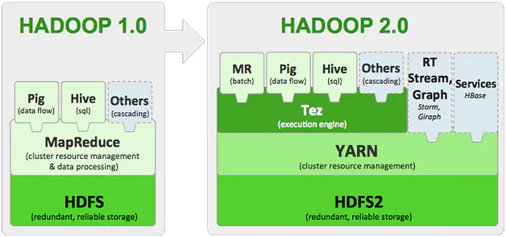 

Fonte: https://www.projectpro.io/article/hadoop-2-0-yarn-framework-the-gateway-to-easier-programming-for-hadoop-users/84

O Yarn é uma evolução do MapReduce, onde as funções do JobTracker são repartidas em Daemons, isto é: Processos independentes.

Uma das funções do MapReduce é realizar as operações de Map e Reduce e a outra função é gerenciar e tratar as falhas. Para isso, o YARN muda um pouco a nomenclatura do Nó master, ele chama de resource manager, e temos ainda o application Master, onde cada aplicação MapReduce é definida pelo nó mestre e o Resource Manager fica responsável por reordenar os nós em caso de falha nos nós escravos.

---

**Computação Distribuída em Cloud Computing** 

A computação nas nuvens ou Cloud Computing consiste na disponibilização de serviços dentro do universo da internet, nesse caso, todo e qualquer sistema pode ser abstraído como parte integrante de uma nuvem.

Esse tipo de modelo é fruto de uma evolução de sistemas que puderam adquirir uma alta capacidade em seu poder de processamento. Melhorando o desempenho de suas atividades e também com alta escalabilidade.

A nuvem pode fornecer diversos tipos de serviços, que podem ser classificados por três categorias:

* IaaS (Infraestrutura como serviço):  Fornece um ambiente para que o usuário possa desfrutar de uma infraestrutura fornecida na web, como armazenamento ou até mesmo um SO.
* PaaS (Plataforma como serviço): Oferece um ambiente capaz de auxiliar no desenvolvimento de uma aplicação. Sem a utilização de um programa específico.
* SaaS (Software como serviço): Um programa pode ser disponibilizado na nuvem, onde o cliente poderá desfrutar da aplicação utilizando apenas o navegador.

---

### Referências

* [1] PROJECTPRO. *Hadoop 2.0 (YARN) Framework - The Gateway to Easier Programming for Hadoop Users*. 2022. Disponível em: <[projectpro.io](https://www.projectpro.io/article/hadoop-2-0-yarn-framework-the-gateway-to-easier-programming-for-hadoop-users/84)> 
* [2] APACHE HADOOP. *HDFS Architeture*. Disponível em: <[hadoop.apache.org](https://hadoop.apache.org/docs/stable/hadoop-project-dist/hadoop-hdfs/HdfsDesign.html)>
* [3] DSA. *Engenharia de Dados com Hadoop e Apache Spark*. Diposnível em: <(DataScienceAcademy.com)[https://www.datascienceacademy.com.br/course/big-data-analytics-engineer]>

---

## Instalação do Hadoop

### Utilitários

Primeiramente irei instalar alguns pacotes utilitários, pois se você acompanhou as últimas postagens sobre o como instalar Linux em uma VM viu que eu instalei apenas o básico para o funcionamento do SO com interface gráfica. Então vamos lá, no terminal:

> `sudo yum install bzip2 unzip rsync wget net-tools`

### MySQL (MariaDB)

É recomendado ter um banco de dados no SO. Portanto irei instalar o mais simples deles, o MariaDB, que é uma versão do MySQL. No terminal:

> `sudo yum install mariadb-server mariadb`

Com a instalação concluída vamos inicializar o serviço de banco de dados e habilitar a sua inicialização no boot com os comandos:

> `sudo systemctl start mariadb.service` 
> `sudo systemctl enable mariadb.service` 

Definindo a senha para o usuário root do Banco de Dados:

> `mysqladmin -u root passwrod 'sua_senha'`

Vamos testar a instalação iniciando o console do MySQL:

> `mysql -u root -p`  
> Digite a sua senha:

Se tudo deu certo é esta a tela que está aparecendo para você no terminal:

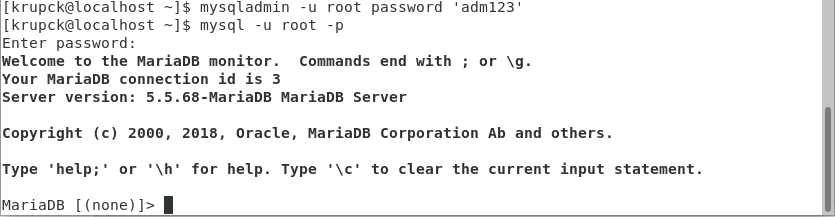

Agora que estamos no console do MariaDB, vamos testar um comando simples só para garantir que tudo está funcionando corretamente:

> `SELECT user, host, password FROM mysql.user;`

> Nota: Não esqueça de utilizar o "; (ponto e vírgula)" no final das instruções SQL aqui no terminal.

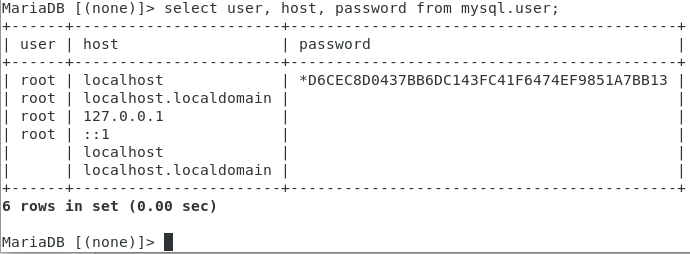

Para sair do console do MariaDB digite `exit;`

### Instalação do servidor SSH

SSH é a sigla para Secure Socket Shell, sendo um dos protocolos específicos de segurança de troca de arquivos entre cliente e servidor de internet, usando criptografia. O objetivo do SSH é permitir que desenvolvedores ou outros usuários realizem alterações em sites e servidores utilizando uma conexão simples e segura.

No terminal:

> `sudo yum install openssh-server openssh-clients`

Ativando o servidor SSH no boot de inicialização:

> `sudo chkconfig sshd on`

Inicializando o serviço:

> `sudo service sshd start`

Para verificar se deu certo:

> `sudo service sshd status`

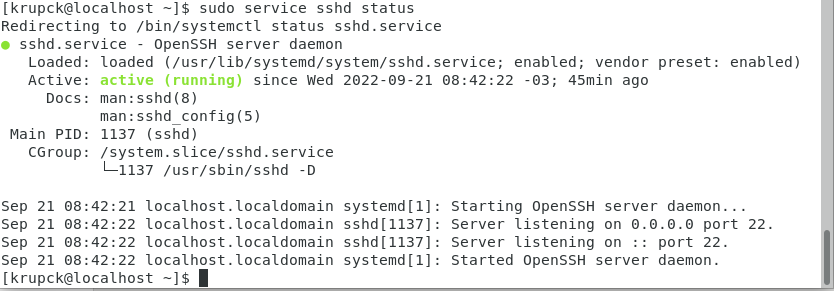

Outra forma de averiguar é verificando as informações de rede na porta 22:

> `sudo netstat -tulpn | grep :22`

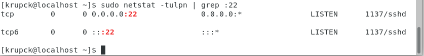

Agora daremos permissão para que o usuário root possa acessar livremente na porta 22. No terminal:

> `sudo gedit /etc/ssh/sshd_config`

No documento que foi abert, remova o # no início das linhas selecionadas:

Primeira parte: 

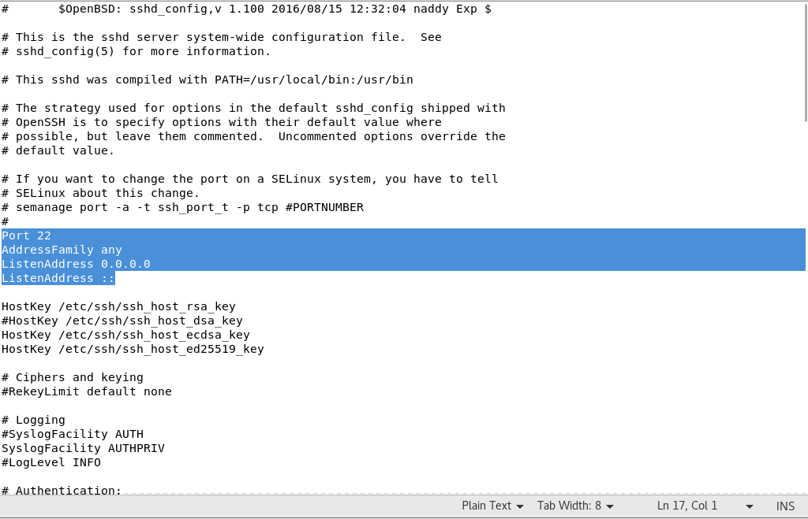

Segunda Parte: 
> Adicione o seu usuário. 

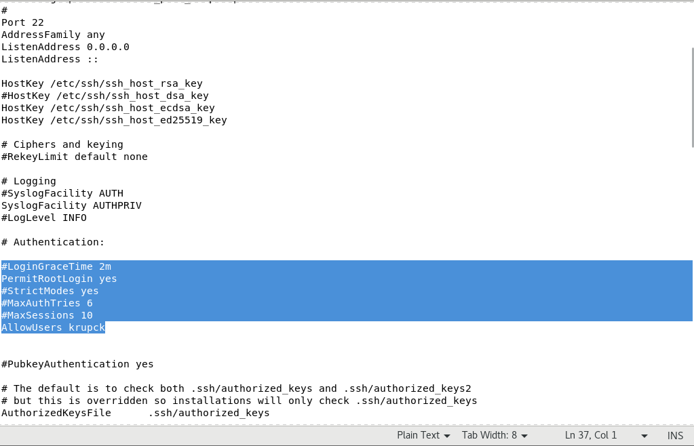

Reinicializando o serviço ssh:

> `sudo service sshd restart`

### Instalação do JRE (Java Runtime Edition)

Como o Hadoop roda sobre a linguagem de programação Java, precisaremos instalar tanto o JRE quanto JDK na nossa máquina:

> `sudo yum install java`

### Instalação do JDK (Java Development Kit)

A mesma coisa para o JDK, mas o processo para instalação do JDK é um pouco diferente. Será necessário navegar até o site da Oracle. Você pode acessar clicando nesse link: <a target="_blank" href="https://www.oracle.com/java/technologies/downloads/">Oracle.com</a>

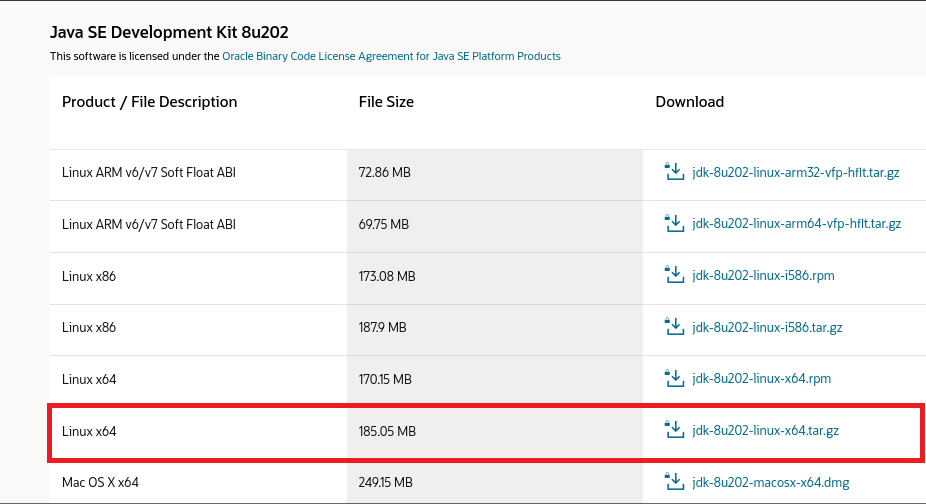

Navegando pelo diretório do arquivo e listando conteúdo da pasta Downloads:

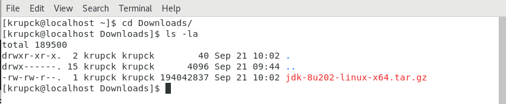

Agora precisamos descompactar o arquivo e mover ele para outro local:

> `tar -xzf jdk-8u202-linux-x64.tar.gz`

Irei mover o jdk que foi extraído para o diretório /usr/local/hadoop_dependencies. Os diretórios usr/ e local/ já existem por padrão. Para criar o diretório hadoop_dependencies, vá em:
> `cd /usr/local` -> Vá até o diretório usr/local/ 
> `sudo mkdir hadoop_dependencies` Crie o diretório hadoop_dependencies/ 
> `cd ~` Volte para o diretório raiz 
> `cd Downloads/` Navegue para o diretório Downloads/ 

Vamos utilizar esse diretório para armazenar todos os pacotes que baixarmos durante a nossa instalação do Hadoop. Dessa forma os arquivos ficam todos organizados.

> `sudo mv jdk1.8.0_202/ /usr/local/hadoop_dependencies/`

Agora iremos criar um link simbólico. Entenda o link simbólico como um atalho para algum diretório ou arquivo. Portanto, quando nos referimos ao java utilizaremos o link simbólico. Dessa forma, é possível controlar as versões dos pacotes de maneira muito mais dinâmica e profissional. Pois não teremos que alterar dezenas de arquivos todas as vezes que alterarmos a versão de algum pacote.

> `sudo ln -s /usr/local/hadoop_dependencies/jdk1.8.0_202/ /opt/jdk`

Faremos a mesma coisa para o JRE:

> `sudo ln -s /usr/lib/jvm/java-1.8.0-openjdk-1.8.0.342.b07-1.el7_9.x86_64/jre/ /opt/jre`

Verificando os links simbólicos:

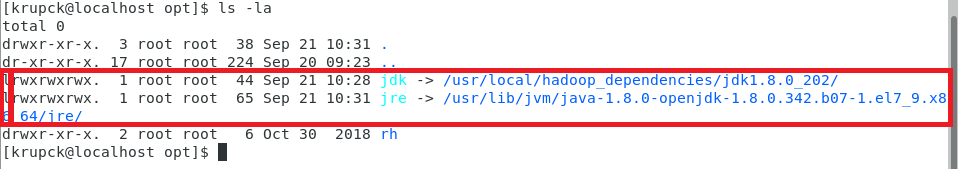

Perceba que o prefixo do tipo do objeto é `l` que significa link.

**Adicionando variáveis de ambiente**

Agora que instalamos o JRE e o JDK, precisamos definir as variáveis de ambiente para que o SO possa identifcar os pacotes que foram instalados.

> `cd ~` 
> `gedit .bashrc` 

O arquivo .bashrc é o arquivo que armazena as variáveis de ambiente. Dentro desse arquivo adicione os valores:

> export JAVA_HOME=/opt/jdk  
> export JRE_HOME=/opt/jre  
> export PATH=$PATH:$JRE_HOME/bin:$JAVA_HOME/bin  

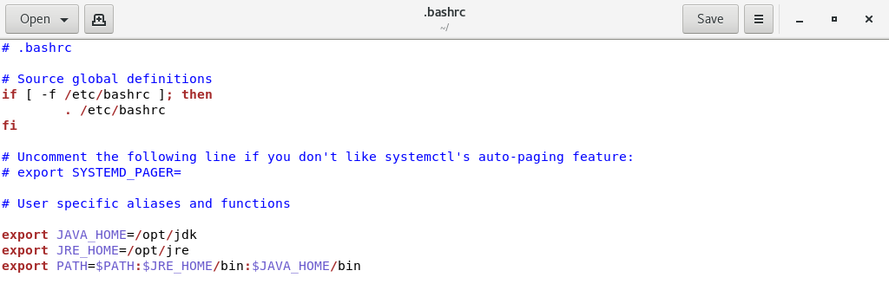

Para atualizar as novas configurações, digite:

> `source .bashrc`

### Desabilitando o IPv6

Alguns recursos do Hadoop não funcionam muito bem com o este protocólo. Portanto, iremos desabilitar para evitar qualquer problema futuro. No terminal, vá em:

> `sudo gedit /etc/sysctl.conf` 

No arquivo de configuração, adicione as seguintes configurações:

> `net.ipv6.all.disable_ipv6 = 1` 
> `net.ipv6.default.disable_ipv6 = 1` 
> `net.ipv6.lo.disable_ipv6 = 1` 

### Configurando o SSH para o Hadoop

Anteriormente havia ativado o SSH, agora nós vamos configurar o SSH para o Hadoop. A primeira coisa que vamos fazer é gerar uma chave de segurança. O SSH é um protocólo de comunicação. No terminal:

> `ssh-keygen -t rsa`

Nesse momento, o SO vai perguntar aonde você quer criar essa chave. Basta digitar enter para criar no diretório sugerido. 
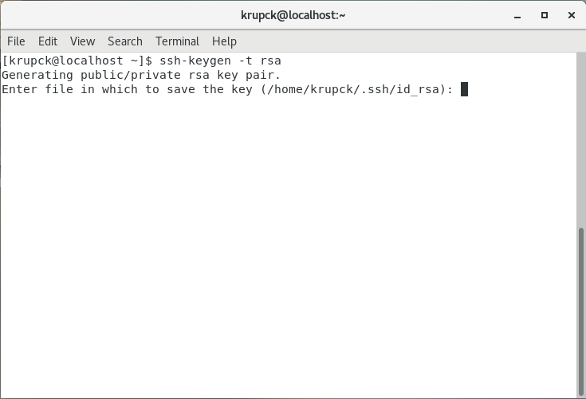

Agora, ele vai perguntar pedir para você digitar uma passphrase. É como se fosse uma senha. Não precisa digitar nada aqui, aperte Enter duas vezes e pronto.

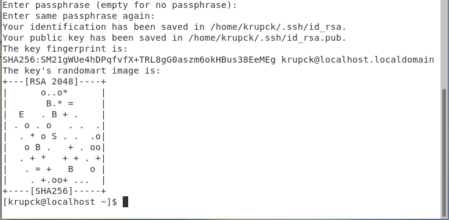

Precisamos que esta chave gerada seja reconhecida e garantida pelo SSH. Portanto, devemos copiar a chave para um arquivo de chaves autorizadas:

> `cat ~/.ssh/id_rsa.pub >> ~/.ssh/authorized_keys` Copiando o arquivo.  
> `chmod 0600 ~/.ssh/authorized_keys` Definindo permissões para esse arquivo.  

Podemos testar o ssh digitando `ssh localhost` no terminal. Digite yes e pronto, conexão estabelecidade.

**Mas para que serve isso afinal?** 
Em um ambiente de cluster real, esse protocólo vai permitir que o NameNode se comunique com o DataNode através do protocólo SSH e sem a necessidade de senhas. Porque imagine só um cluster com 1000 máquinas, onde cada máquina precisa digitar a senha para se comunicar com o NameNode? Seria inviável, por isso configuramos o SSH.

Para finalizar a configuração do SSH, vamos dizer quais são as máquinas que podem conectar no nosso servidor.

> `sudo gedit /etc/hosts`

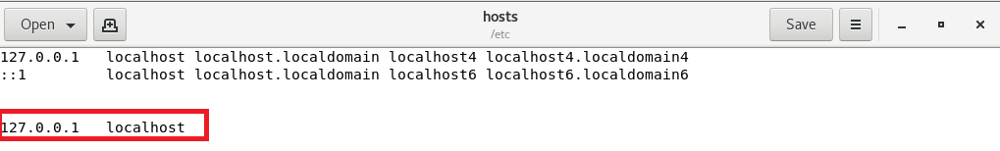

---

### Instalação do Hadoop

Agora sim estamos prontos para começar a instalar o Hadoop. A instalação do hadoop em si é bastante simples, porém, realizar todas as configurações necessárias para trabalharmos com um cluster, aí sim teremos um pouco mais de trabalho.

Acesso o site oficial para downloads do Hadoop: [download dos binários](https://dlcdn.apache.org/hadoop/common/hadoop-3.3.4/hadoop-3.3.4.tar.gz)

Por padrão o arquivo será baixado no diretório de Downloads. Mas você pode baixar totalmente via linha de comando no diretório atual inserindo:

> `wget https://dlcdn.apache.org/hadoop/common/hadoop-3.3.4/hadoop-3.3.4.tar.gz`

O arquivo foi baixado com sucesso, veja:

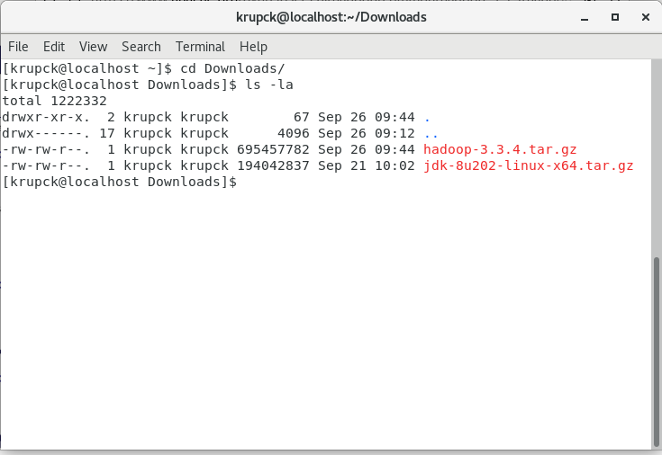

Descompactando o arquivo:

> `tar -xzf hadoop-3.3.4.tar.gz`

Faremos um passo a passo bem parecido com a instalação do JDK. Primeiro movemos o arquivo para o diretório /usr/local/hadoop_dependencies, depois criamos um links simbólico e configuramos as variáveis de ambiente.

> `sudo mv hadoop-3.3.4 /usr/local/hadoop_dependencies/`Movendo o arquivo para outro diretório 
> `sudo ln -s /usr/local/hadoop_dependencies/hadoop-3.3.4/ /opt/hadoop` Criação do link simbólico 

No diretório raiz:
> `gedit .bashrc`

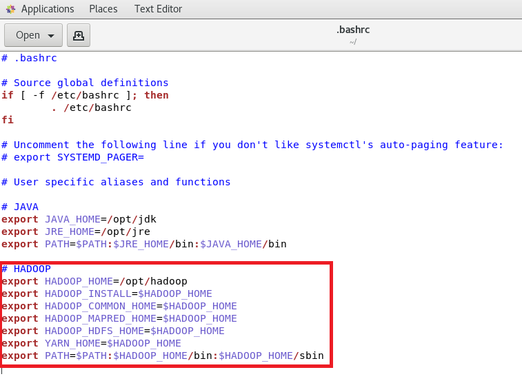

Salve o editor de textos, feche o arquivo e então digite o comando source para atualizar as variáveis de ambiente:

> `source .bashrc`

---

### Adicionando parâmetros de Configuração

Temos o Hadoop instalado. Precisamos realizar as configurações em seus arquivos de configurações. Navegue até o diretório de arquivos de configuração do Hadoop:

> `cd /opt/hadoop/etc/hadoop`

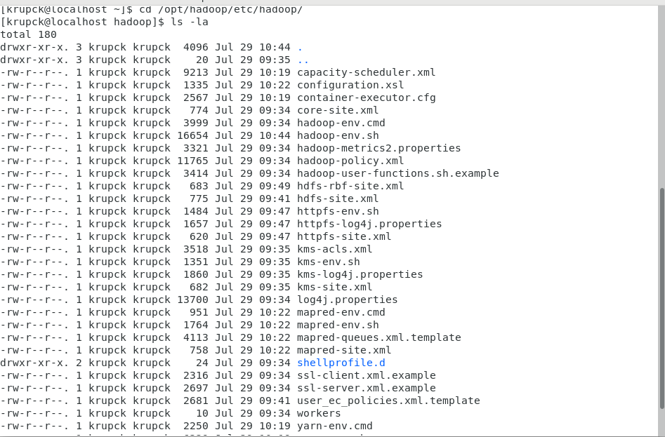

Será necessário editar cinco arquivos neste diretório, são eles:

> `gedit hadoop-env.sh`

Adicione os seguintes valores:

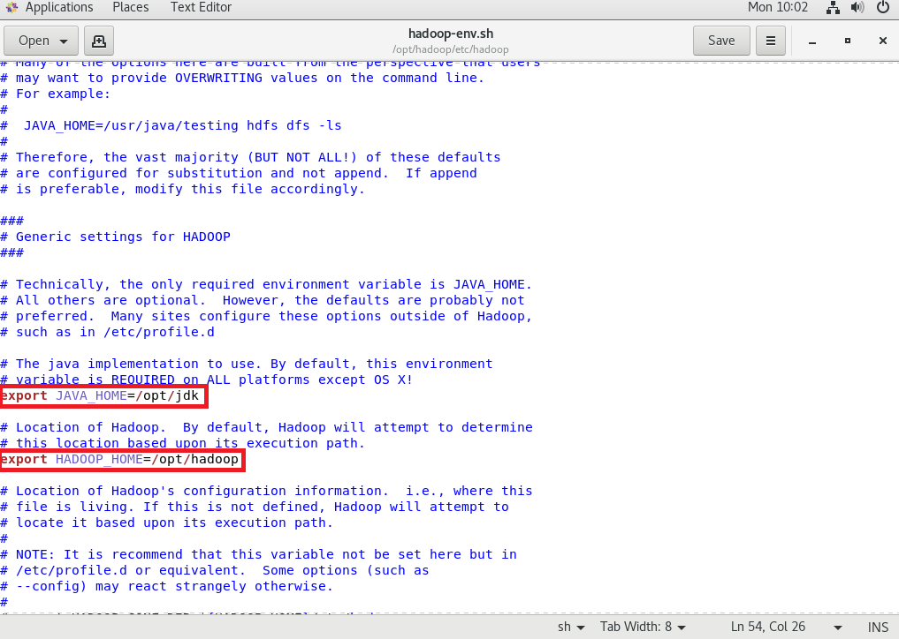

---

> `gedit core-site.xml`

Veja que o arquivo vem vazio, porque o Hadoop está no modo Standalone. Queremos colocá-lo em modo Pseudo-Distribuído. Para isso, devemos adicionar tags de configuração:

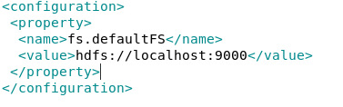

Esse parâmetro indica que o sistema de arquivos padrão para o meu Hadoop será o HDFS e que tudo será apontado para o localhost na porta 9000.

---

> `gedit hdfs-site.xml`

Esse parâmetro dfs.replication com o valor igual a 1 basicamente diz que não queremos replicar os blocos de arquivos para mais de um node. 

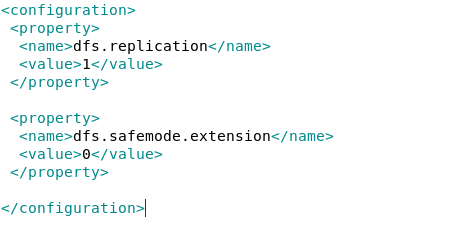

---

> `gedit mapred-site.xml`

Aqui eu vou informar para o Hadoop como eu quero que seja feita a gestão dos recursos. E essa gestão será feita pelo Yarn.

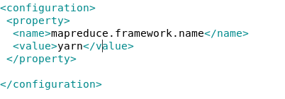

---

> `gedit yarn-site.xml`

Um dos serviços que queremos que o Yarn gerencie é o mapreduce shuffle, etapa intermediária entre o map e o reduce.

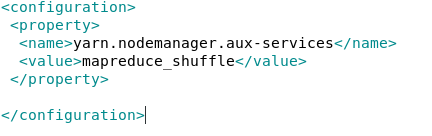

---

### Vericando instalação

Depois de todas essa configurações vamos finalmever averiguar se o Hadoop está funcionando:

> `hadoop version`

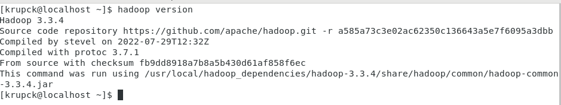

Esta é a mensagem que deve aparecer para você caso o Hadoop tenha sido instalado corretamente.

---

Verificando se os arquivos de configuração foram instalados corretamente:

> `hdfs namenode -format`

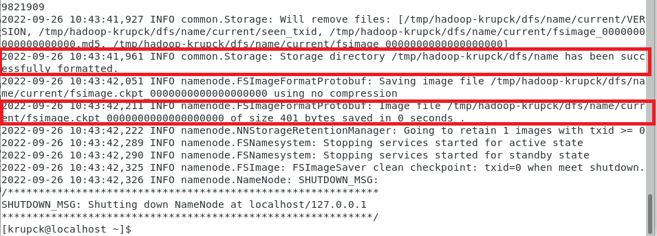

Aqui a mensagem que queremos, indicando se ocorreu tudo bem com a inicialização do namenode.

---

## Iniciando o Hadoop

Se você chegou até aqui, viu que há bastante coisas para serem configuradas até que possamos utilizar o Hadoop na prática. Tenho duas notícias:

* A boa notícia: Já podemos inicializar o Hadoop e utilizar o seu sistema gerenciador de arquivos HDFS e disparar os jobs MapReduce. 
* A má notícia: Temos o mais básico do hadoop, ainda estamos na metade do caminho se quisermos utilizar os principais recursos do framework.

A instalação do HBase, Hive, Zookeeper e outros recursos do Hadoop eu irei deixar para os próximos tutoriais. Agora vamos brincar um pouco com o temos até aqui.

Para iniciar o Hadoop digite:
> `start-dfs.sh` 

Duranta a configuração dos arquivos nós definimos que o Yarn ficaria responsável por gerenciar as operações de MapReduce do Hadoop. Então vamos iniciar o yarn:

> `start-yarn.sh` 

Para verificar os processos java ativos, digite:

> `jps`

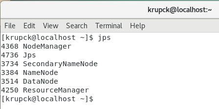

Vamos verificar o estado do cluster Hadoop. No teu browser navegue até o seguinte endereço: `http://localhost:8088`

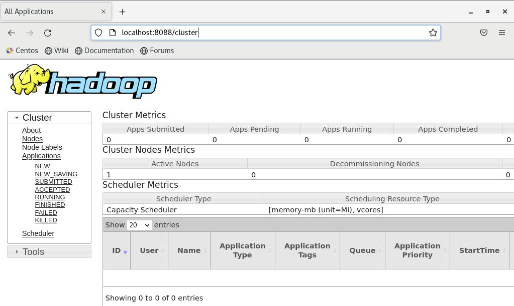

Para utilizar o sistema de arquivos do Hadoop não há segredos. Se você sabe linux, muito provavelmente saberá utilizar o HDFS sem problemas. O Hadoop fornece dois tipos de comandos para interagir com o File System; `hadoop fs` ou `hdfs dfs`. A principal diferença é que os comandos do hadoop são compatíveis com vários sistemas de arquivos, como S3, Azure e muitos outros.

Vou mostrar alguns comandos básicos, você pode utilizar o prefixo `hdfs dfs` ou `hadoop fs`:

> `hdfs dfs -mkdir /nome_diretorio`: Criar diretório.  
> `hdfs dfs -rmdir /nome_diretorio`: Remover diretório. 
> `hdfs dfs -rm /nome_diretorio`: Remover arquivo. 
> `hdfs dfs -rmr /nome_diretorio`: Remove o arquivo identificado por caminho/pasta e subpastas. 
> `hdfs dfs -ls /path`: Exibir conteúdo do diretório 
> `hdfs dfs -put /path/file`: Faz o upload do arquivo para o hdfs. 
> `hdfs dfs -cat /path/file`: Exibe o conteúdo do arquivo. 
> `hdfs dfs -du /path/file`: Exibe o tamanho do arquivo no HDFS. 
> `hdfs dfs -dus /path/file`: Exibe o tamanho total do diretório/arquivo no HDFS. 
> `hdfs dfs -get /path/file`: Armazena arquivo/diretório do HDFS para o sistema de arquivos local. 
> `hdfs dfs -getmerge /path/file`: Armazena múltiplos arquivos/diretórios do HDFS para o sistema de arquivos local. 
> `hdfs dfs -count /path/file`: Conta o número de diretório, número de arquivos e tamanho do arquivo. 
> `hdfs dfs -mv /path/origin /path/destiny`: Move o arquivo/diretório da origem para o destino. 
> `hdfs dfs -moveFromLocal /path/origin /path/destiny`: Move arquivo/diretório do disco local para HDFS. 
> `hdfs dfs -moveToLocal /path/origin /path/destiny`: Move arquivo/diretório do HDFS para o disco local. 
> `hdfs dfs -cp /path/origin /path/destiny`: Copia o arquivo/diretório da origem para o destino. 
> `hdfs dfs -copyFromLocal /path/origin /path/destiny`: Copia o arquivo/diretório da origem local para o destino HDFS. 
> `hdfs dfs -copyToLocal /path/origin /path/destiny`: Copia o arquivo/diretório da origem HDFS para a destino local. 
> `hdfs dfs -head /path/file`: Exibe o primeiro kilobyte do arquivo. 
> `hdfs dfs -tail /path/file`: Exibe o último kilobyte do arquivo. 
> `hdfs dfs -chmod /path/file`: Altera as permissões do arquivo/diretório. 
> `hdfs dfs -find /path/file`: Procura o arquivo dentro da estrutura HDFS. 

Para encerrar os serviços do Hadoop e do Yarn:
> `stop-dfs.sh` 
> `stop-yarn.sh` 

---

## Considerações finais

Aprender sobre o ecossistema Hadoop não é uma tarefa trivial. E na era dos serviços em Cloud abre o questionamento, vale mesmo a pena dedicar tempo e esfoço em aprender um framework que eu provavelmente nunca vou encontrar no dia-a-dia de uma empresa? 

Bom, se você for pesquisar a fundo vai perceber que a maioria dos serviços de Big Data em nuvens oferecidos pelas principais empresas do mercado: AWS, Microsoft e várias outras, são na verdade modificações do Hadoop. Então, estudando o Hadoop possibilitará você entender o cerne do Big Data e também acumular conhecimento para aprender com muito mais facilidade os serviços em nuvens oferecidos por estas empresas.  

Finalizando este tutorial, eu gostaria de agradecer para quem chegou até aqui. Se gostou do conteúdo, deixa o like e se quiser pode me seguir nas redes sociais que eu pretendo sempre estar postando conteúdos relacionados a Big Data, Machine Learning e Data Science:

* <a target="_blank" href="https://github.com/krupique">github.com/krupique</a> 
* <a target="_blank" href="https://www.linkedin.com/in/henrique-krupck/">linkedin.com/henrique-krupck</a> 

### Fim
